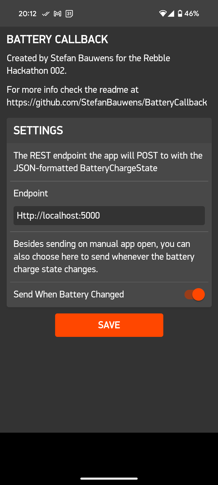

# Battery Callback
This is a battery tool I created for the Rebble Hackaton #002.
It gives you the possibility to (automatically) post your Pebble's battery status to a REST server.
The payload is a JSON-formatted string that follows the same structure as BatteryStateService. (See https://developer.rebble.io/developer.pebble.com/docs/c/Foundation/Event_Service/BatteryStateService/index.html#BatteryChargeState)

## Features:
v1.0:
- send battery charge state to custom endpoint
- manual and event-driven callback 

## Ingration with Tasker
### Tasker as server
Don't want to set up your own server for this endpoint? You can just use Tasker on your mobile phone with the HTTP-Request event. 
Set the Method to `POST` and set the endpoint in the Battery Callback watch app settings to `http://localhost:PORT` (PORT being the port you specified in Tasker).
From there you can create a Task that processes the `%http_request_body`. 

### Request battery stae
You can also use Tasker to trigger a battery callback on demand! Using intents you can trigger the app to open on the watch, which will call the endpoint automatically.
1. Create a new task and select the 'Send Intent' action (Under System). 
2. Set Action to: `com.getpebble.action.app.START`
3. Set Extra to: `uuid:bfa0936b-a7ab-433c-8092-a93e934b9944`
